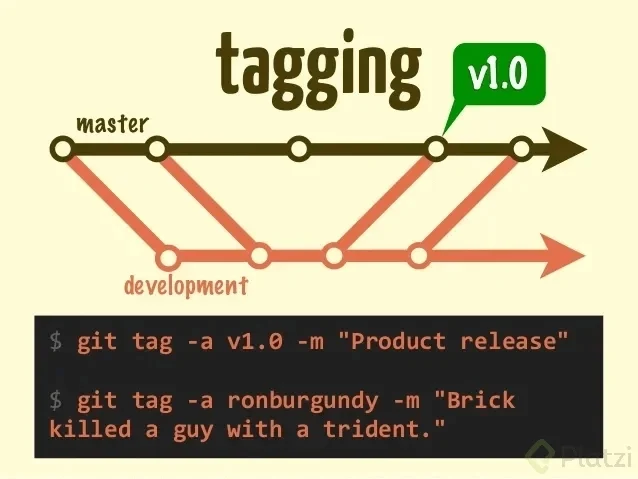

# CLASE MIÉRCOLES 27 DE MARZO DEL 2024

>Lo que vimos en la clase anterior:

<sub>
Abrimos la terminal de Git Bash en Window o la terminal de Ubuntu, tambien la terminal de Mac, y comenzamos con los siguientes comandos y creación de directorios</sub>

```sh
pwd  #Vemos la ruta de la carpeta en la que estamos

cd #Es para navegar a una carpeta: change directory -> cambiar de directorio

cd / #Nos llava al home, en la raíz del disco

cd ~ #La virgulilla significa que estamos en el lugar de los documentos o del usuario

ls #Esto es listar los archivos, nos muestra todos los archivos en la raíz

ls -al #El espacio -al significa que es un argumento especial para ver archivos ocultos
#Usar la flecha hacía arriba nos muestra el último comando utilizado

ls -l #Muestra casi todos los archivos sin los que están ocultos

ls -a #Muestra el grupo de archivos pero no en una lista

clear #Limpia la consola o ctrl + l

cd .. #Nos devuelve a la carpeta anterior

cd U + tab #Esto se usa para un autocompletado o para buscar una referencia

cd /D #Cambiamos de disco en window

df -h #Muestra todos los directorios en Ubuntu

cd /mnt/d #Cambia de directorio usando WSL Ubuntu en window
```


## AHORA COMENZAMOS CON LA CREACIÓN DE CARPETAS

```sh
cd ..

cd ..

cd /mnt/c

cd ~ #Vamos a la raíz

mkdir Tecnicatura #Recordar que en window las mayúsculas no tienen relevancia, pero si en Linux

cd tecnicatura

mkdir Python

mkdir Java

mkdir JavaScript
```
<sub>
Revisar y ejecutar cada comando, hacerlo como practica</sub>
<sub>
Profesor Ariel Betancud</sub>

## CLASE MIÉRCOLES 3 DE ABRIL DEL 2024

<sub>Abrir git bash en Window o la terminal de Linux o de Mac: al abrir Git Bash hacerlo como administrador</sub>

```sh
touch vacio.txt #Crea un archivo con su extención: ESCRIBIR DENTRO

ctrl + s #Guardamos lo que escribimos en el archivo

./ #Significa la carpeta actual

../ #Significa la carpeta anterior

cat vacio.txt #Vemos el contenido del archivo

history #Veremos la historia completa de los comandos que hemos utilizado

!72 + enter #Veremos el comando que utilizamos en ese número

rm vacio.txt #Borra el archivo seleccionado, ¡¡¡¡CUIDADO!!!!

rm --help #Muestra como funciona el comando
```

# CREAR UN REPOSITORIO DE GIT Y HAZ TU PRIMER COMMIT

```sh
cd tecnicatura

mkdir class-git

cd class-git #Entramos en la carpeta que necesitamos trabajar

git init #Creamos un repositorio en la carpeta central, se crea el archivo .git

code .  #Abrimos VSC, el punto hace que se abra el archivo en el que estamos situados

ctrl + n #Creamos un archivo nuevo y escribimos en el, como lo hicimos antes

ctrl + s #Guardamos poniendo el nombre: historia.txt

git status #Vemos el estado del proyecto en tiempo real, esta en el área de trabajo

git add historia.txt #Enviamos el archivo al área de preparación

git status #Para ver el estado de cambios

git rm --cached historia.txt #Quitamos el archivo del área de preparación, cached significa que esta 

en memoria ram

git config #Tedremos la lista de como funciona la configuración

git config --list #Configuraciones por defecto, faltan cosas importantes

git config --list --show-origin #Veremos donde están las configuraciones guardadas

git config --global user.name "Ariel Betancud"

git config --global user.email "betancudariel@gmail.com" #El correo debe ser el mismo que usaremos en GitHub

git config --list #Ahora veremos que ya están todos los datos completos

git add . #Ingresamos todos los archivos al área de preparación (ram)

git commit -m "Mensaje importante del commit" #El primer commit esta hecho

code . #Hacemos cambios en el archivo y guardamos

git status #Hay cambios para commitear

git add .

git commit -m "Mi segundo commit"

git log historia.txt #Vemos toda la historia de este archivo, el número largo es el hash del commit
```

<sub>
Revisar y ejecutar cada comando, hacerlo como practica
</sub>
<sub>
Profesor Ariel Betancud</sub>

## CLASE MIÉRCOLES 10 DE ABRIL DEL 2024

<sub>
Analizar cambios en los archivos de tu proyecto Git parte 3</sub>
<sub>
Ingresamos de la siguiente manera:</sub>
<sub>
Abrir git bash en Window o la terminal de Linux o de Mac: al abrir Git Bash hacerlo como administrador, en terminal también o usar sudo para permisos especiales.
</sub>

```sh
cd tecnicatura #Ingresamos al direcotorio donde están nuestras carpetas de trabajo

ls #Vemos los archivos y directorios que ya tenemos

cd git #No hay nada

cd .. #Salimos

rm historia.txt #Eliminamos el archivo que habíamos hecho, esto en git bash (window) esto es para practica

rm Git #rm: cannot remove 'Git': Is a directory

rm --recursive -R Git #By default, rm does not remove directories.  Use the --recursive (-r or -R) arguments

option to remove each listed directory, too, along with all of its contents. Esto es para practica

rm --help #Nos muestra lo que les puse arriba como documentación en Inglés.

mkdir class-git #Creamos la carpeta o directorio para trabajar en Git local por ahora.

cd class-git #Entramos para crear el README.md para este sector.

touch README.md #Vamos a crear un archivo nuevo, md significa markdown y se pueden trabajar con editores de texto, este es un lenguaje que transforma el texto a html.
```

<sub> Enlace a la documentación en GitHub de MARKDOWN
Leemos la documentación para ir creando en README.md como lo enseña GitHub.</sub>

```sh
code . #Abrimos VSC para editar el archivo.
```

***Empezamos a cargar lo visto en las clases anteriores (Comandos) en el README y pasamos a commitear***

```sh
git status

git add .

git status

git commit -m "Cargamos el README dentro del directorio class-git"

git status

git log #Para ver los dos commits hechos: Si tienes commiteada alguna clase anterior veras mas commits de los que yo tengo.

cd ..

cd ..
```

<sub>Revisar y ejecutar cada comando, hacerlo como practica</sub>

<sub>Profesor Ariel Betancud</sub>

## CLASE 4 MIÉRCOLES 17 DE ABRIL DEL 2024

<sub>Analizar cambios en los archivos de tu proyecto Git parte 4</sub>

<sub>Ingresamos de la siguiente manera:</sub>

<sub>Abrir git bash en Window o la terminal de Linux o de Mac: al abrir Git Bash hacerlo como administrador, en terminal también o usar sudo para permisos especiales.</sub>

>TAREA -> AGREGAR LOS COMENTARIOS EN LOS COMANDOS, PARA SABER QUE PASA CON CADA UNO.</sub>

```sh
cd tecnicatura

cd class-git

ls

touch historia.txt

code .
#Modificamos el archivo historia.txt colocando lo siguiente: Bienvenido     mi nombre es Ariel (coloca tu nombre)

ctrl + s

git status

git add .

git status

git commit #Sin agregar -m veremos que pasa
#Agregar mensaje y salir con

Esc #Presionamos Escape 

:wq! + enter #Y ya salimos si estamos en git bash con window

Esc + shift + z + z #Salimos del mensaje para el commit, en linux, esto anda en algunas terminales
#Agregamos otra línea de mensaje en historia.txt desde VSC: estoy estudiando programación

ctrl + s

git add .

git commit
#Se abre un editor de código basado en línea de comandos, editor de texto como VSC llamado vim

Esc + i #Para comenzar a escribir mensaje del commit, no suele ser necesario

ctrl + x #Para salir en linux

s + enter #Para decir si al cambio y aceptar el nombre, ósea no cambiamos el nombre, la (s) es de si y la (y) es de yes, no olvidar enter en linux

git show #Vemos todos los cambios en el último commit

git log historia.txt #Vemos todos los commit

q #Para salir del registro de commits
#Copiamos un hash mas antoguo y otro reciente, ingresamos el siguiente comando

git diff hash_commit_numerico hash_commit_numerico #Comparamos diferentes commits y sus cambios, poner la versión mas vieja primero, luego la mas nueva

q #Para salir

cd ..

cd ..
```

## CLASE 5 MIÉRCOLES 8 DE MAYO DEL 2024

<sub>Volver en el tiempo en nuestro repositorio utilizando reset y checkout parte 6</sub>

<sub>Ingresamos de la siguiente manera:</sub>

<sub>Abrir git bash en Window o la terminal de Linux o de Mac: al abrir Git Bash hacerlo como administrador, en terminal también o usar sudo para permisos especiales.</sub>

>TAREA -> AGREGAR LOS COMENTARIOS EN LOS COMANDOS, PARA SABER QUE PASA CON CADA UNO.

```sh
cd tecnicatura

cd class-git

ls

code .

git log #Vemos los commit hechos hasta ahora

Copiar el hash #El número largo que tiene el commit

git reset hash-nombre-commit #Este nos permite volver a una versión anterior, hay 2 tipos de reset: el duro y el suave

git status

git add .

git commit -m "Agregamos datos de estudios en historia.txt"

git config --list #Veremos la configuración que ya hemos hecho con en nombre y email

git reset hash-nombre-commit --hard #Es el duro, todo vuelve a su estado anterior, es el más usado, desaparece todo

git reset hash-nombre-commit --soft #Este es el suave, lo que tengamos en staging segirá allí

crear un archivo #portafolio.html introducir el código y

touch portafolio.html

html : 5 #Con esto se carga el código básico de html y modificamos

ctrl + s #Guardamos

Clic derecho en VSC Open with Live Server para ver en el navegador

git status

ls

ls -al

git add .

git status

git commit -m "Agregamos el html para nuestro portafolio"

creamos CSS #Este es un archivo de estilos, para esto creamos una nueva carpeta llamada css

mkdir css

ls

cd css

touch style.css #creamos un archivo dentro: estilos.css le cargamos el código.

ctrl + s #abrimos en el navegador y todo esta allí, pero todo esto supuestamente en git no existe.

git status #tenemos cosas en el área de trabajo, en staging distintas

git diff + enter #y nos muestra los cambios en memoria ram y en disco

git add . #Agregamos todo al staging

git status #Ya esta todo en memoria ram, a git solo le importan los archivos, guarda las carpetas como rutas y automaticamente las crea

git commit -m "Creamos el css para darle algo de estilo a nuestro portafolio"

git log #vemos lo nuevo que hemos hecho sin lo que borramos con el reset fuerte

hacer cambios en historia.txt #Cambiamos la última línea y

ctrl + s 

git diff

git commit -am "cambio en la última línea del historia.txt"

git log

q  #Esto para salir

git log --stat #veremos los cambios especificos que hicimos en cuales archivos por medio del commit y veremos los cambios en bits

q #salimos de la línea de commits, ahora queremos ver como era originalmente el archivo, osea la primera versión, copiamos el nombre del primer commit

git checkout hash-nombre-commit historia.txt #Veremos el archivo en su estado original

git status #Nos sugiere hacer un commit, si lo hacemos borramos todo lo que hicimos antes, debemos seguir con el siguiente commando

git checkout master historia.txt #Volvemos a la versión master del archivo historia.txt, esto es muy peligroso

git checkout hash-nombre-commit historia.txt #Volvemos a hacer esto y cambiamos cosas del archivo

git commit -am "Reemplazo de una versión por otra de la historia"

git log #Veremos los cambios sin tocar ningun otro archivo, esta es la forma de volver a una versión hacía atrás y llevarla a la cabeza de la master

cd ..

cd ..
```

## CLASE 6 MIÉRCOLES 15 DE MAYO DEL 2024

<sub>Git reset vs. Git rm parte 7</sub>

>Los comandos git reset y git rm tienen utilidades muy diferentes, pero pueden confundirse fácilmente.


<sub>GIT RESET</sub>


<sub>El comando git reset es una herramienta poderosa que te permite deshacer o revertir cambios en tu repositorio de Git. Lo puedes ejecutar de tres maneras diferentes, con las líneas de commando --soft, --mixed y --hard.</sub>

<sub>Pero como git checkout que nos deja ir, mirar, pasear y volver. Con git reset volvemos al pasado sin la posibilidad de volver al futuro. Borramos la historia y la debemos sobreescribir. No hay vuelta atrás.</sub>

<sub>Tres árboles en Git Para entender lo anterior, recordemos que los “tres árboles” de Git son estructuras de datos basadas en nodos y punteros que Git utiliza para hacer seguimiento a un cronograma de ediciones, aunque no sean estructuras en forma de árbol en el sentido tradicional.</sub>

<sub>La mejor forma de entender estos mecanismos es creando un conjunto de cambios en un repositorio y siguiéndolos a través de los tres árboles. Averigüémoslo.</sub>

<sub>Ingresamos de la siguiente manera:</sub>

<sub>Abrir git bash en Window o la terminal de Linux o de Mac: al abrir Git Bash hacerlo como administrador, en terminal también o usar sudo para permisos especiales.</sub>

>TAREA -> AGREGAR LOS COMENTARIOS EN LOS COMANDOS, PARA SABER QUE PASA CON CADA UNO.

```sh
mkdir git_reset_test #Vamos a hacer pruebas, es por esto que creamos una carpeta nueva

cd git_reset_test #Entramos en la carpeta

git init #Inicializamos el repositorio

touch reset_file.txt

git add reset_file.txt

git commit -m"Iniciando el primer commit"
```
<sub>
¿Cómo funciona Git Reset en tu flujo de trabajo? </sub>
<sub>
Git reset permite moverte entre diferentes commits para deshacer o rehacer cambios. Git guarda todo lo nuevo del repositorio como commits, que son instantáneas del estado del código en un momento dado y existen variaciones de este comando.</sub>
<sub>
Variaciones de Git Reset </sub>

```sh
git reset --soft: Borra el historial y los registros de Git de commits anteriores, pero guarda los cambios en Staging para aplicar las últimas actualizaciones a un nuevo commit. 

git reset --hard: Deshace todo, absolutamente todo. Toda la información de los commits y del área de staging se elimina del historial. 

git reset --mixed: Borra todo, exactamente todo. Toda la información de los commits y del área de staging se elimina del historial. 
```
<sub>
git reset HEAD: El comando git reset saca archivos del área de staging sin borrarlos ni realizar otras acciones. Esto impide que los últimos cambios en estos archivos se envíen al último commit. Podemos incluirlos de nuevo en staging con git add si cambiamos de opinión. Ten en cuenta que, si deshaces commits en un repositorio compartido en GitHub, estarás cambiando su historia y esto puede causar problemas de sincronización con otros colaboradores.
</sub>
<sub>¿Qué es git reset HEAD? </sub>
<sub>
git reset HEAD es un comando que te permite revertir los cambios que ya habías preparado para subir, y moverlos de vuelta a tu proyecto. Con este comando puedes cancelar los cambios que ya habías agregado, para que puedas revisarlos, modificarlos o deshacerlos antes de confirmarlos con un commit.</sub>
<sub>
git rm Por otro lado, es un comando que nos ayuda a eliminar archivos de Git sin eliminar su historial del sistema de versiones. Para recuperar el archivo eliminado, necesitamos retroceder en la historia del proyecto, recuperar el último commit y obtener la última confirmación antes de la eliminación del archivo.</sub>
<sub>
Es importante tener en cuenta que git rm no puede usarse sin evaluarlo antes. Debemos usar uno de los flags siguientes para indicarle a Git cómo eliminar los archivos que ya no necesitamos en la última versión del proyecto.</sub>
<sub>
Variaciones de Git rm</sub>

```sh
git rm --cached: Elimina archivos del repositorio local y del área de staging, pero los mantiene en el disco duro. Deja de trackear el historial de cambios de estos archivos, por lo que quedan en estado untracked, que significa: que un archivo no está siendo rastreado por Git

git rm --force: Elimina los archivos de Git y del disco duro. Git guarda todo, por lo que podemos recuperar archivos eliminados si es necesario (empleando comandos avanzados). ¡Al usar git rm lo que haremos será eliminar este archivo completamente de git!
```
<sub>
¿Cuál es la diferencia entre git rm y git reset Head?</sub>
<sub>
La diferencia principal entre git rm y git reset HEAD radica en que git rm elimina archivos del repositorio y de la historia del proyecto, mientras que git reset saca los cambios del área de preparación y los mueve del espacio de trabajo, sin afectar la historia del repositorio.</sub>
<sub>
Es importante tener en cuenta el efecto que cada comando tiene en el proyecto y usarlos según tus necesidades y objetivos específicos.</sub>
<sub>
¿Cuándo utilizar git reset en lugar de git revert? </sub>
<sub>
Para reescribir la historia del repositorio y eliminar confirmaciones anteriores, se utiliza git reset. Para deshacer cambios de confirmaciones anteriores de forma segura sin modificar la historia del repositorio, se emplea git revert.
</sub>
<sub>
Resumen Para evitar problemas en el trabajo, es valioso entender las implicaciones y riesgos de cada comando y elegir el enfoque adecuado según las necesidades y el flujo de trabajo del proyecto.</sub>
<sub>
Con git rm eliminamos un archivo de Git, pero mantenemos su historial de cambios. Si no queremos borrar un archivo, sino dejarlo como está y actualizarlo después, no debemos usar este comando en este commit.</sub>
<sub>
Empleando git reset HEAD, movemos los cambios de Staging a Unstaged, pero mantenemos el archivo en el repositorio con los últimos cambios en los que hicimos commit. Así, no perdemos nada relevante.</sub>
<sub>
Siguientes pasos Bueno, todos los cambios están en el área de Staging, incluido el archivo con los cambios que no están listos. Esto significa que debemos sacar ese archivo de Staging para poder hacer commit de todos los demás.
</sub>
<sub>
Crear cambios en el archivo creado, donde vamos a hacer varios commits, para ir probando los nuevos comandos, al finalizar las pruebas, eliminar el directorio con todo su contenido.</sub>

## CLASE 7 MIÉRCOLES 22 DE MAYO DEL 2024

<sub>Flujo de trabajo básico con un repositorio remoto parte 8</sub>

<sub>
Cuando empiezas a trabajar en un entorno local, el proyecto vive únicamente en tu computadora. Esto significa que no hay forma de que otros miembros del equipo trabajen en él.</sub>
<sub>
Para solucionar esto, utilizamos los servidores remotos: un nuevo estado que deben seguir nuestros archivos para conectarse y trabajar con equipos de cualquier parte del mundo.</sub>
<sub>
Estos servidores remotos pueden estar alojados en GitHub, GitLab, BitBucket, entre otros. Lo que van a hacer es guardar el mismo repositorio que tienes en tu computadora y darnos una URL con la que todos podremos acceder a los archivos del proyecto. Así, el equipo podrá descargarlos, hacer cambios y volverlos a enviar al servidor remoto para que otras personas vean los cambios, comparen sus versiones y creen nuevas propuestas para el proyecto.</sub>
<sub>
Esto significa que debes aprender algunos nuevos comandos</sub>

<sub>
Comandos para trabajo remoto con GIT</sub></sub>

```sh
git clone url_del_servidor_remoto #Nos permite descargar los archivos de la última versión de la rama principal y todo el historial de cambios en la carpeta .git

git push #Luego de hacer git add y git commit debemos ejecutar este comando para mandar los cambios al servidor remoto.

git fetch #Lo usamos para traer actualizaciones del servidor remoto y guardarlas en nuestro repositorio local (en caso de que hayan, por supuesto).

git merge #También usamos el comando git merge con servidores remotos. Lo necesitamos para combinar los últimos cambios del servidor remoto y nuestro directorio de trabajo.

git pull #Básicamente, git fetch y git merge al mismo tiempo.

#Adicionalmente, tenemos otros comandos que nos sirven para trabajar en proyectos muy grandes:

git log --oneline #Te muestra el id commit y el título del commit.

git log --decorate #Te muestra donde se encuentra el head point en el log.

git log --stat #Explica el número de líneas que se cambiaron brevemente.

git log -p #Explica el número de líneas que se cambiaron y te muestra que se cambió en el contenido.

git shortlog #Indica que commits ha realizado un usuario, mostrando el usuario y el título de sus commits.

git log --graph --oneline --decorate --all

git log --pretty=format #"%cn hizo un commit %h el dia %cd": Muestra mensajes personalizados de los commits.

git log -3 #Limitamos el número de commits.

git log --after=“2018-1-2”

git log --after=“today” 

git log --after=“2018-1-2” --before=“today” #Commits para localizar por fechas.

git log --author=“Name Author” #Commits hechos por autor que cumplan exactamente con el nombre.

git log --grep=“INVIE” #Busca los commits que cumplan tal cual está escrito entre las comillas.

git log --grep=“INVIE” –i #Busca los commits que cumplan sin importar mayúsculas o minúsculas.

git log – index.html #Busca los commits en un archivo en específico.

git log -S “Por contenido” #Buscar los commits con el contenido dentro del archivo.

git log > log.txt #guardar los logs en un archivo txt
```

## CLASE 8 MIÉRCOLES 29 DE MAYO DEL 2024
<sub>
Introducción a las ramas o branches de Git parte 9</sub>
<sub>
Cuando entramos en el proyecto veremos que nos encontramos con la rama master, y es a partir de allí que debe saber que esta es la rama madre o principal rama, y las otras ramas se crean para no afectar a la master</sub>

<sub>
Las ramas (branches) son la forma de hacer cambios en nuestro proyecto sin afectar el flujo de trabajo de la rama principal. Esto porque queremos trabajar una parte muy específica de la aplicación o simplemente experimentar.</sub>
<sub>
La cabecera o HEAD representan la rama y el commit de esa rama donde estamos trabajando. Por defecto, esta cabecera aparecerá en el último commit de nuestra rama principal. Pero podemos cambiarlo al crear una rama (git branch rama, git checkout -b rama) o movernos en el tiempo a cualquier otro commit de cualquier otra rama con los comandos (git reset id-commit, git checkout rama-o-id-commit).</sub>
<sub>
Repasa: ¿Qué es Git?</sub>
<sub>
Cómo funcionan las ramas en GIT<sub>
<sub>
Las ramas son la manera de hacer cambios en nuestro proyecto sin afectar el flujo de trabajo de la rama principal. Esto porque queremos trabajar una parte muy específica de la aplicación o simplemente experimentar.
</sub>

```sh
git branch nombre de la rama #Con este comando se genera una nueva rama.

git checkout nombre de la rama #Con este comando puedes saltar de una rama a otra.

git checkout -b rama #Genera una rama y nos mueve a ella automáticamente, Es decir, es la combinación de git branch y git checkout al mismo tiempo.

git reset id-commit #Nos lleva a cualquier commit no importa la rama, ya que identificamos el id del tag., eliminando el historial de los commit posteriores al tag seleccionado.

git checkout rama-o-id-commit #Nos lleva a cualquier commit sin borrar los commit posteriores al tag seleccionado.
```

<sub>
Vamos a hacer una practica: mientras la rama master esta cambiando normalmente, vamos a crear una rama paralela que va a crear nuevas secciones: osea una sección y a esta rama la vamos a llamar segunda y con esto, la vamos a fusionar para ver como queda en la rama master y así entender el flujo de ramas entre git. Al crear otra rama estamos creando una copia de todos los commit que ya tiene la rama master en la nueva rama y todos los cambios que hagamos en esta nueva rama, no los va a ver la rama master hasta que no la volvamos a fusionar con un proceso que se llama merge.</sub>

```sh
Abrir terminal #En ubuntu

Abrir como adminstrados git bash #En window

cd Tecnicatura

cd class-git

code . #En ubuntu

code . #En window, abrir como administrador

ctrl + s #Guardamos

clic mouse derecho #Abrimos en el navegador con Live Server vemos los cambios

git status

git commit -am "mensaje del commit" #Este solo funciona con archivos creado previamente

git commit -a -m "Mensaje del commit" #Esto es lo mismo que el anterior

git commit -a + enter #Se abrira el entorno para editar el vim con el mensaje

Escribir el mensaje

ctrl + x

s + enter #No cambiar el nombre ni ruta de ubicación

git log #Veremos los cambios guardados

q #Para salir

git log --stat #Veremos los cambios nombrando cada archivo

q #Para salir

git branch #Muestra en la rama que estamos, desde aquí crearemos una nueva

git show #Muestra el último cambio que hicimos, esto significa que desde el HEAD -> master es que haremos cambios

q #Para salir

ctrl + l #Limpiamos consola

git branch segunda #creamos una nueva rama

git show #Nos muestra ahora que esta en el HEAD -> master, cabecera aquí es donde esta apuntando, es decir el último commit esta pegado a dos ramas distintas, aunque todavía estemos en master

q #Para salir

git status #No hay nada para hacer commit

git chekout segunda #Nos movemos hacía otras ramas, en este caso a segunda, esto no se ve en mac ni en ubuntu, para ver donde estamos hay que ingresar...

git branch #veremos en que rama estamos ubicados o ingresando...

git status #Veremos en que HEAD estamos apuntando

ctrl + s 

F5 #Actualizamos en el navegador para ver los cambios

git status #Veremos el archivo que modificamos

git add .

git commit

vim escribimos el mensaje del commit

ctrl + x

s #Para un si 

enter #Terminado el mensaje del commit

git status #No hay mas nada para commitear y estamos en la rama segunda

git show #Vemos todo lo que cambiamos

q #Para salir

git log #Nos muestra donde estabamos con la rama master y el HEAD paso a la rama cabecera

q #Para salir

git checkout master #Volvemos a la rama master, desaparese lo que habíamos hecho

git log #No muestra lo que hicimos en el portafolio

q #Para salir


git checkout segunda #Volvemos a ver todos los cambios que hicimos de nuevo
```
## CLASE 10 MIÉRCOLES 5 DE JUNIO DEL 2024 - Portafolio 4
<sub>
Fusión de ramas con Git merge parte 10</sub>
<sub>
La fusión en Git es la forma en que este sistema une un historial bifurcado. El comando git merge permite integrar líneas de desarrollo independientes generadas por git branch en una sola rama. Con este comando, podemos crear un nuevo commit que combina dos ramas o branches: la rama actual y la rama que se indica después del comando.</sub>
<sub>
Estos comandos de fusión del merge afectan solo a la rama actual y no a la rama de destino. Por lo tanto, te recomendamos utilizar git checkout para seleccionar la rama actual y git branch -d para eliminar la rama de destino obsoleta.</sub>

<sub>
Funcionamiento de Git merge</sub>
<sub>
Git merge fusiona secuencias de confirmaciones en un solo historial, generalmente para combinar dos ramas. Busca una confirmación de base común y genera una confirmación de fusión que representa la combinación de las dos ramas hasta el resultado final.</sub>
<sub>
¿Cómo unir dos ramas en git?</sub>
<sub>
Ahora bien, para combinar ramas en tu repositorio local, usa git checkout para cambiar a la rama donde deseas fusionar. Por lo general, esta es la rama principal. Luego, emplea git merge y especifica el nombre de la otra rama que deseas traer a esta rama. Ten en cuenta que esto es una combinación de avance rápido.</sub>
<sub>
¿Cómo realizar un merge en git?</sub>
<sub>
Para hacer un merge en Git, primero asegúrate de estar en la rama correcta. Después, usa el comando git merge seguido del nombre de la rama que quieres combinar. Por ejemplo, si quieres crear un nuevo commit en la rama master con los cambios de la rama segunda, usa este comando:
</sub>

```sh
git checkout master

git merge segunda
```

<sub>
Es importante tener en cuenta que en caso de haber conflictos, debes guardar tus cambios antes de hacer git checkout para evitar perder tu trabajo. También es recomendable emplear los comandos básicos de GitHub, como git fetch, git push y git pull, para mantener actualizado tu repositorio.</sub>
<sub>
En este ejemplo, vamos a crear un nuevo commit en la rama master combinando los cambios de una rama llamada segunda: Otra opción es crear un nuevo commit en la rama segunda combinando los cambios de cualquier otra rama:</sub>
<sub>
Git es asombroso porque puede saber cuáles cambios deben conservarse en una rama y cuáles no. En casos de conflictos, asegúrate de guardar tus cambios antes de hacer git checkout para evitar perder tu trabajo.</sub>
<sub>
Comandos básicos de GitHub:
</sub>

```sh
git init # crear un repositorio, si ya esta en la nube traerlo sin hacer git init

git add . #agregar un archivo a staging.

git commit -m “mensaje” #guardar el archivo en git con un mensaje.

git branch nombre_rama #crear una nueva rama.

git checkout nombre_rama #moverse entre ramas.

git push origin rama #mandar cambios a un servidor remoto.

git fetch #traer actualizaciones del servidor remoto y guardarlas en nuestro repositorio local.

git merge rama #tiene dos usos. Uno es la fusión de ramas, funcionando como un commit en la rama actual, trayendo la rama indicada. Su otro uso es guardar los cambios de un servidor remoto en nuestro directorio.

git pull origin rama #fetch y merge al mismo tiempo.

git checkout “codigo de version” “nombre del archivo” #volver a la última versión de la que se ha hecho commit.

git reset #vuelve al pasado sin posibilidad de volver al futuro, se debe usar con especificaciones.

git reset --soft #vuelve a la versión en el repositorio, pero guarda los cambios en staging. Así, podemos aplicar actualizaciones a un nuevo commit.

git reset --hard #todo vuelve a su versión anterior

git reset HEAD #saca los cambios de staging, pero no los borra. Es lo opuesto a git add.

git rm #elimina los archivos, pero no su historial. Si queremos recuperar algo, solo hay que regresar. se utiliza así:

git rm --cached #elimina los archivos en staging pero los mantiene en el disco duro.

git rm --force #elimina los archivos de git y del disco duro.

git status #estado de archivos en el repositorio.

git log #historia entera del archivo.

git log --stat #cambios específicos en el archivo a partir de un commit.

git show #cambios históricos y específicos hechos en un archivo.

git diff “codigo de version 1” “codigo de version 2” #comparar cambios entre versiones.


git diff #comparar directorio con staging.


Comando en producción: TUVE QUE SOLUCIONAR UN CONFLICTO

git status #En rama segunda: hacemos cambios en el archivo y guardamos

git commit -am "Finalizado el cambio en rama segunda" #enter

git status

git checkout master #perdemos todo lo que ya habíamos hecho, hacemos cambios en el archivo agregando un nuevo parrafo y guardamos

git commit -am "Agregado el contenido adicional del archivo y un mejor aporte"

git checkout segunda #vemos como desaparecen los cambios

git checkout master #Aquí es que vamos a hacer el merge

git merge segunda #En mi caso tuve algunos conflictos que solucione a través de VSC, aclaro que nunca debemos utilizar Fusionar los dos cambios

git commit -am "Arreglando conflicto" #Una vez solucionado debemos commitear

git status #Debemos revisar en el navegador y en el código si algo quedo mal y cambiarlo

git commit -am "Solucionado el conflicto 2"

git merge segunda #ahora todo va bien

git commit -am "Volvi a comentar en este caso de mi area laboral" #Añado información al archivo

git log

q #Para salir

git commit -am "Para guardar estos cambios en el README.md"

git checkout segunda

git merge master #Traemos todos los cambios

git commit -am "Cargamos esto ahora" #vamos a master y mergeamos

git checkout master


git merge segunda #y terminamos con esto
```

## CLASE 11 MIÉRCOLES 12 DE JUNIO DEL 2024 - Portafolio 5
<sub>
Resolución de conflictos al hacer merge parte 11</sub>
<sub>
Sección lectura</sub>
<sub>
Git nunca borra nada, a menos que nosotros se lo indiquemos. Cuando usamos los comandos git merge o git checkout estamos cambiando de rama o creando un nuevo commit, no borrando ramas ni commits (recuerda que puedes borrar commits con git reset y ramas con git branch -d).</sub>
<sub>
Git es muy inteligente y puede resolver algunos conflictos automáticamente: cambios, nuevas líneas, entre otros. Pero algunas veces no sabe cómo resolver estas diferencias, por ejemplo, cuando dos ramas diferentes hacen cambios distintos a una misma línea.</sub>
<sub>
Esto lo conocemos como conflicto y lo podemos resolver manualmente. Solo debemos hacer el merge, ir a nuestro editor de código y elegir si queremos quedarnos con alguna de estas dos versiones o algo diferente. Algunos editores de código como Visual Studio Code nos ayudan a resolver estos conflictos sin necesidad de borrar o escribir líneas de texto, basta con hacer clic en un botón y guardar el archivo.</sub>
<sub>
Recuerda que siempre debemos crear un nuevo commit para aplicar los cambios del merge. Si Git puede resolver el conflicto, hará commit automáticamente. Pero, en caso de no pueda resolverlo, debemos solucionarlo y hacer el commit.</sub>
<sub>
Los archivos con conflictos por el comando git merge entran en un nuevo estado que conocemos como Unmerged. Funcionan muy parecido a los archivos en estado Unstaged, algo así como un estado intermedio entre Untracked y Unstaged. Solo debemos ejecutar git add para pasarlos al área de staging y git commit para aplicar los cambios en el repositorio.</sub>
<sub>
Cómo revertir un merge Si nos hemos equivocado y queremos cancelar el merge, debemos usar el siguiente comando:
</sub>

```sh
git merge --abort
```
<sub>
Conflictos en repositorios remotos Al trabajar con otras personas, es necesario utilizar un repositorio remoto.</sub>
­<sub>
-Para copiar el repositorio remoto al directorio de trabajo local, se utiliza el comando git clone , y para enviar cambios al repositorio remoto se utiliza git push.</sub>
<sub>
-Para actualizar el repositorio local se hace uso del comando git fetch, luego se debe fusionar los datos traídos con los locales usando git merge.</sub>
<sub>
Para traer los datos y fusionarlos a la vez, en un solo comando, se usa git pull.</sub>
<sub>
­- Para crear commits rápidamente, fusionando git add y git commit -m "", usamos git commit -am "".</sub>
<sub>
­- Para generar nuevas ramas, hay que posicionarse sobre la rama que se desea copiar y utilizar el comando git branch .</sub>
<sub>
Para saltar entre ramas, se usa el comando git checkout</sub>
<sub>
­- Una vez realizado los cambios en la rama, estas deben fusionarse con git merge.</sub>
<sub>
El merge ocurre en la rama en la que se está posicionado. Por lo tanto, la rama a fusionar se transforma en la principal.</sub>
<sub>
Los merges también son commits.</sub>
<sub>
Los merges pueden generar conflictos, esto aborta la acción y pide que soluciones el problema manualmente, aceptando o rechazando los cambios que vienen.</sub>
<sub>
Repasa qué es un branch</sub>
<sub>
Sección Práctica
</sub>


```sh
git checkout segunda #falta lo que cargamos en master

git merge master #traemos los cambios desde la master y tenemos las dos ramas actualizadas
```

<sub>
Ahora vamos a crear un conflicto para ver como salimos de el, vamos a cargar datos nuevos creando archivos html y css estando en la rama segunda, y también vamos a hacer lo mismo estando en la master y veremos como lo solucionamos.</sub>


<sub>
Abrimos el html y modificamos estando en la rama segunda</sub>


<sub>
Luego commiteamos en la rama segunda y pasamos a la rama master, guardar y commitear, hacer un merge estando en master: pongo en orden los comandos abajo.
</sub>


```sh
ctrl + s #Guardamos los cambios en la rama segunda, ponemos cambios en css

git commit -am "Modifique el css y el color del texto" es un ejemplo

git checkout master #Modificamos el html, ponemos código y css ponemos texto blue

ctrl + s #Guardamos los cambios

git commit -am "Agregue suscripción, cambie el código y puse todo azul en css"

git merge segunda #Hacemos un merge estando en master y veremos el conflicto
```

<sub>
Para solucionar el conflicto podemos abrir el archivo con el editor de texto y modificar lo que nos este señalando y guardamos, esto en el css y en el html, lo podemos hacer desde VSC seleccionando: el cambio entrante.</sub>


<sub>
Debemos ahora commitear estos cambios, abajo pongo los comandos.
</sub>


```sh
git status

git commit -am "Solución de conflictos al mergear las ramas"

git checkout segunda #Seguiremos con la versión anterior, porque el merge fue en master

git merge master #Ahora pasamos los cambios a la rama segunda.
```

## CLASE 12 MIÉRCOLES 19 DE JUNIO DEL 2024 - Portafolio 6

<sub>
Cómo funcionan las llaves públicas y privadas parte 12</sub>
<sub>
Sección lectura</sub>
<sub>
Las llaves públicas y privadas, conocidas también como cifrado asimétrico de un solo camino, sirven para mandar mensajes privados entre varios nodos con la lógica de que firmas tu mensaje con una llave pública vinculada con una llave privada que puede leer el mensaje.</sub>
<sub>
Las llaves públicas y privadas nos ayudan a cifrar y descifrar nuestros archivos de forma que los podamos compartir sin correr el riesgo de que sean interceptados por personas con malas intenciones.</sub>
<sub>
Cómo funciona un mensaje cifrado con llaves públicas y privadas Ambas personas deben crear su llave pública y privada.</sub>
<sub>
Ambas personas pueden compartir su llave pública a las otras partes (recuerda que esta llave es pública, no hay problema si la “interceptan”).</sub>
<sub>
La persona que quiere compartir un mensaje puede usar la llave pública de la otra persona para cifrar los archivos y asegurarse que solo puedan ser descifrados con la llave privada de la persona con la que queremos compartir el mensaje.</sub>
<sub>
El mensaje está cifrado y puede ser enviado a la otra persona sin problemas en caso de que los archivos sean interceptados.</sub>
<sub>
La persona a la que enviamos el mensaje cifrado puede emplear su llave privada para descifrar el mensaje y ver los archivos.</sub>
<sub>
Nota: puedes compartir tu llave pública, pero nunca tu llave privada.</sub>

## CLASE 13 MIÉRCOLES 26 DE JUNIO DEL 2024 - Portafolio 7

<sub>
Configura tus llaves SSH en local parte 13</sub>

<sub>
Si usamos GitHub solo con usuario y contraseña, si un día perdemos nuestra PC, perdemos todo, nuestras contraseñas y los proyectos de nuestros clientes están todos en riesgo. Esta es la forma en que muchos sitios web son jackeados, para evitar esto tenemos que agregar una capa de seguridad mucho más fuerte. Es aquí donde podemos comenzar a crear el entorno con llaves publicas y privadas. Esto tiene una ventaja, no solo es que nuestra seguridad será más fuerte, si no que ya no tendrás que poner nunca más tu usuario y contraseña.</sub>

<sub>
En nuestra maquina, debemos crear una llave privada y otra pública, una vez creada la llave pública se la enviamos a GitHub en nuestro repositorio, y le decimos: para este repositorio quiero que uses esta llave pública, de mi llave privada en mi PC, todo esto lo conectamos por un protocolo nuevo, en vez de conectarnos al repositorio por HTTPS, vamos a conectarnos por un protocolo que se llama SSH.</sub>

<sub>
En la primera conección GitHub se va a dar cuenta que le mandaste una llave publica que esta relacionada con tu llave privada y nos va a enviar cifrada con nuestra llave pública su propia llave pública de GitHub, porque GitHub también tiene una llave privada, todo esto sucederá automaticamente, a la llave privada que nosotros tenemos, se le puede hacer una contraseña encima, para añadir más seguridad para hacerla mas fuerte y más poderosa.</sub>

<sub>
Las llaves SSH no son por repositorio o por proyecto, si no que es por persona, ahora vamos a crear unas llaves exclusivamente para nosotros.</sub>
<sub>
En este ejemplo, aprenderemos cómo configurar nuestras llaves SSH en local.</sub>
<sub>
Comandos:</sub>
<sub>
abrir git bash #Esto en window</sub>
<sub>
abrir terminal #En ubuntu, y nos quedamos sin entrar a ningun proyecto o carpeta.
</sub>

```sh
git config -l #Recordamos nuestra configuración en Git, podemos hacer esto estando en la ruta de cualquier sitio en nuestro PC

git config --global user.email "alumnos@mail.com" #Actualizamos el correo que usamos en GitHub.

ssh-keygen -t rsa -b 4096 -C "alumnos@mail.com" #Dira que esta generando la llave pública y privada, también nos pregunta donde vamos a guardar la llave, presionamos enter, nos va a pedir otra contraseña

eval $(ssh-agent -s) #Encendemos el servidor de llaves SSH, ya esta corriendo

~ #Se utiliza virgulilla para poner la ruta, es una variable que tiene el nombre de nuestra carpeta home, esto para el siguiente comando

ssh-add ~/.ssh/id_ga35745 #Añadimos la llave, no la .pub ponemos la llave privada, recordar que es una ruta, se debe poner el nombre de la carpeta que contiene la clave privada.


Cómo generar tus llaves SSH:

a. Generar tus llaves SSH**

Recuerda que es muy buena idea proteger tu llave privada con una contraseña.

ssh-keygen -t rsa -b 4096 -C "tu@email.com"

b. Terminar de configurar nuestro sistema.

En Windows y Linux:

Encender el “servidor” de llaves SSH de tu computadora:

eval $(ssh-agent -s)

Añadir tu llave SSH a este “servidor”:

ssh-add ruta-donde-guardaste-tu-llave-privada

En Mac:


Encender el “servidor” de llaves SSH de tu computadora:

eval "$(ssh-agent -s)"

Si usas una versión de OSX superior a Mac Sierra (v10.12), debes crear o modificar un archivo “config” en la carpeta de tu usuario con el siguiente contenido (ten cuidado con las mayúsculas): vim config

Host *


AddKeysToAgent yes

UseKeychain yes

IdentityFile ruta-donde-guardaste-tu-llave-privada

Añadir tu llave SSH al “servidor” de llaves SSH de tu computadora (en caso de error puedes ejecutar este mismo comando pero sin el argumento -K):

ssh-add -K ruta-donde-guardaste-tu-llave-privada
```

<sub>
Por último les quiero hablar del 2FA: Segundo Factor de Autenticación. Este se puede hacer con varios dispositivos, y deberías hacerlo, ante el robo o perdida de un celular o ordenador, deberías tener un respaldo ante esto, este 2FA se puede hacer con diferentes generadores de códigos  de seguridad.</sub>
<sub>
Para añadir un 2FA:
</sub>

```sh
1. Clic en nuestro perfil, arriba y a la derecha, seleccionamos...

2. Settings

3. Password and Authentication

4. GitHub Mobile: GitHub Mobile can be used for two-factor authentication by installing the GitHub Mobile app and signing in to your account. -> GitHub Mobile se puede utilizar para la autenticación de 2FA instalando la aplicación GitHub Mobile e iniciando sesión en su cuenta.

Esto quiere decir que también se utiliza la app de GitHub donde al iniciar sesión desde cualquier dispositivo nos muestra un número que debemos ingresar en la app de nuestro dispositivo celular.

5. Authenticator app: Edit
```

<sub>
Esto para agregar a través de un QR una app que genere cada 1 segundo nuevos códigos numéricos para la autenticación, yo recomiendo la aplicación: Twilio Authy Authenticator</sub>
<sub>
Es recomendable iniciar sesión, osea registrarnos y guardar estos datos para que al cambiar un dispositivo sigamos teniendo acceso.
</sub>
# CLASE 01 MIÉRCOLES 14 DE AGOSTO DEL 2024

## USO DE GITHUB Parte 1
<sub>
GitHub es una plataforma que nos permite guardar repositorios de Git que podemos usar como servidores remotos y ejecutar algunos comandos de forma visual e interactiva (sin necesidad de la consola de comandos).
<sub>
Luego de crear nuestra cuenta, podemos crear o importar repositorios, crear organizaciones y proyectos de trabajo, descubrir repositorios de otras personas, contribuir a esos proyectos, dar estrellas y muchas otras cosas.
<sub>
## COMANDOS

**Import repository**, **New repository**, **New organization**: significa que es como tu empresa,  
**New project**: significa es como un grupo de repositorios que puedes tener dentro de una empresa,  
**New gist**: es un pedacito de código que puedes compartir.

### New repository

- **Ponemos el nombre**: `class-git`
- **Descripción**: Haremos un blog increíble.
- **Licencias**: Hay muchas licencias para publicar el código, pero **NO** lo hacemos ahora.

### Create repository
<sub>
- Lo ponemos en **privado** o en **público**.</sub>
<sub>
El `README.md` es el archivo que veremos por defecto al entrar a un repositorio. Es una muy buena práctica configurarlo para describir el proyecto, los requerimientos y las instrucciones que debemos seguir para contribuir correctamente.</sub>

### Clonar un repositorio
<sub>
Para clonar un repositorio desde GitHub (o cualquier otro servidor remoto) debemos copiar la URL (por ahora, usando HTTPS) y ejecutar el comando:</sub>

```bash
git clone URL

Esto descargará la versión de nuestro proyecto que se encuentra en GitHub.

ATENCIÓN:
¿Por qué usar HTTPS? Porque nos pedirá usuario (nombre perfil) y contraseña.

Sin embargo, esto solo funciona para las personas que quieren empezar a contribuir en el proyecto.

Conectar un repositorio de GitHub a nuestro documento local
Si queremos conectar el repositorio de GitHub con nuestro repositorio local, aconsejo que al trabajar desde GitHub no utilicemos localmente el comando git init. Debemos ejecutar las siguientes instrucciones:

1. Guardar la URL del repositorio de GitHub con el nombre de origin:

git remote add origin URL

2. Verificar que la URL se haya guardado correctamente:

git remote
git remote -v

3. Traer la versión del repositorio remoto y hacer merge para crear un commit con los archivos de ambas partes. Podemos usar:

git fetch
git merge

O solo:

git pull origin master --allow-unrelated-histories

4. Finalmente, podemos hacer git push para guardar los cambios de nuestro repositorio local en GitHub:

git push origin master


Cómo autenticarte en GitHub 2022

1. Antes de empezar, debemos renombrar la rama master a main, este es el nuevo estándar en GitHub. Para esto:

2. Posicionarnos en la rama que queremos renombrar.

Ejecutar el siguiente comando:

git branch -M main


Pasos para crear un token de acceso personal
Desde el 2022, GitHub ya no permite hacer push con la contraseña del propio GitHub. Para esto tenemos que crear un token, y este token es la contraseña que vamos a colocar cuando nos pida clave.

Cómo crear un token:
1. Ingresamos a nuestra cuenta de GitHub.
2. Buscamos Settings.
3. Click en Developer settings.
4. Click en Personal access tokens.
5. Click en Generate new token.

Aquí se puede colocar un nombre, la fecha de expiración, tildar en repo y luego hacer click en el botón verde Generate token.
```

# CLASE 02 - MIÉRCOLES 21 DE AGOSTO DEL 2024

## Cargar la llave SSH pública en GitHub
<sub>
Para copiar la llave pública, debes ir al archivo `.ssh` y allí encontrarás el archivo `.pub`. Lo puedes abrir con un editor de texto (como un `.txt`) y luego copiar el contenido que está dentro.</sub>

### Pasos:
<sub>
1. Copiar la llave pública.
2. Ir a GitHub, a **Settings** y luego a **SSH and GPG keys**.
3. Crear una nueva llave SSH:
   - Hacer click en **New SSH key**.
   - Poner un nombre y pegar la llave SSH pública.
   - Con esto estará listo.
</sub>
> **Recomendación**: Es aconsejable que la llave SSH tenga el nombre del ordenador en el que estás trabajando. Este proceso se debe hacer con cada nueva PC o dispositivo que utilices para acceder a tu cuenta de GitHub.

---

## Comandos útiles:

- Ver en qué rama estamos:

  ```bash
  git branch
  ```

- Cambiar a la rama `master`:

  ```bash
  git checkout master
  ```

- Cambiar el nombre de la rama `master` a `main`:

  ```bash
  git branch -M main
  ```

- Agregar el repositorio remoto (reemplazar `nombreUsuario` con tu nombre de usuario):

  ```bash
  git remote add origin git@github.com:nombreUsuario/class-git.git
  ```

- Verificar si ya está conectado:

  ```bash
  git remote -v
  ```

- Hacer un `merge` de la rama `segunda` en `main`:

  ```bash
  git merge segunda
  ```

- Realizar un commit con un mensaje:

  ```bash
  git commit -am "Uso de GitHub parte 20"
  ```

- Subir los cambios a GitHub:

  ```bash
  git push origin main
  ```

---

## Notas sobre el cambio de nombre de la rama `master` a `main`:

Frente al cambio de nombre de la rama `master` a `main`, puede suceder que en el repositorio de GitHub se creen dos ramas: la rama `master` y la rama `main`. Para solucionarlo:

1. Ir al repositorio en GitHub.
2. Ir a **Settings**.
3. Cambiar la rama principal de `master` a `main`.
4. Después de esto, ya se puede borrar la rama `master`.

# CLASE 03 - MIÉRCOLES 28 DE AGOSTO DEL 2024

## Cambios en GitHub: de `master` a `main`

El escritor argentino Julio Cortázar afirma que las palabras tienen color y peso. Por otro lado, los sinónimos existen por definición, pero no expresan lo mismo. **Feo** no es lo mismo que **desagradable**, ni **aromático** es lo mismo que **oloroso**.

Por lo anterior, podemos afirmar que los sinónimos no expresan lo mismo, no tienen el mismo “color” ni el mismo “peso”.

> **Sí**, esta lectura es parte de la enseñanza profesional de **Git & GitHub**.

Desde el 1 de octubre de 2020, GitHub cambió el nombre de la rama principal: ya no es `master` —como aprenderás aquí— sino `main`.

Este cambio surgió a raíz de una reflexión profunda, provocada por el movimiento **#BlackLivesMatter**.  
La industria de la tecnología lleva muchos años utilizando términos como **master**, **slave**, **blacklist** o **whitelist**, y se espera que pronto estos términos puedan desaparecer.

> **Y sí, las palabras importan.**

Por lo tanto, de aquí en adelante, cada vez que me escuches mencionar “master”, debes saber que hago referencia a “main”.

### ¿Cuándo sigue siendo `master` y cuándo es `main`?

Cuando se crea un repositorio desde Git Bash en nuestro ordenador usando `git init`, sigue siendo el estándar como `master`.  
¿Qué hacer con esto? Debes cambiar el nombre de la rama `master` a `main` con el siguiente comando:

```bash
git branch -M main

Ahora, cuando creamos un repositorio desde la nube (desde GitHub), la rama principal tendrá por defecto el nombre de main, y al clonarlo en nuestro ordenador seguirá teniendo este nombre. En este caso, no será necesario ningún cambio.
```

# CLASE 04 - MIÉRCOLES 4 DE SEPTIEMBRE DEL 2024

## Tu primer `push`

La creación de las llaves **SSH** es necesaria solo una vez por cada computadora. Aquí aprenderás cómo conectarte a GitHub usando **SSH**.

Luego de crear nuestras llaves **SSH**, podemos entregarle la llave pública a GitHub para comunicarnos de forma segura y sin necesidad de escribir nuestro usuario y contraseña todo el tiempo.

### Pasos para configurar la llave SSH:

1. Ir a la configuración de **SSH Keys** en GitHub.
2. Crear una nueva llave con el nombre que desees.
3. Pegar el contenido de la llave pública de tu computadora.

Ahora podemos actualizar la URL que guardamos en nuestro repositorio remoto, pero en lugar de usar **HTTPS**, vamos a usar la URL con **SSH**:

```bash
git remote set-url origin url-ssh-del-repositorio-en-github

Comandos para copiar la llave SSH pública:

Mac:
pbcopy < ~/.ssh/id_rsa.pub

Windows (Git Bash):
clip < ~/.ssh/id_rsa.pub

Linux (Ubuntu):
cat ~/.ssh/id_rsa.pub

Importante
Las buenas prácticas nos enseñan que antes de hacer un push, siempre debemos hacer un pull o un fetch, para asegurarnos de que si alguien ha hecho algún cambio, no se generen conflictos.

Invitar a un colaborador
Para invitar a un colaborador a tu proyecto en GitHub, sigue estos pasos:

1. Ve a Settings en el repositorio.
2. Selecciona Collaborators.
3. Ingresa tu contraseña o utiliza el 2FA (autenticación de dos factores) para verificar.
4. Enviar la invitación escribiendo el nombre de usuario del colaborador.

Del otro lado, el usuario invitado solo debe aceptar la invitación y ya podrá participar en el proyecto haciendo commits.
```

# CLASE 05 - MIÉRCOLES 11 DE SEPTIEMBRE DEL 2024

## Git tags y versiones en GitHub

En Git, las **etiquetas** o **Git tags** juegan un papel importante al asignar versiones a los commits más significativos de un proyecto. Aprender a utilizar el comando `git tag`, entender los diferentes tipos de etiquetas, cómo crearlas, eliminarlas y compartirlas es esencial para un flujo de trabajo eficiente.

---

### Creación de etiquetas en Git

Para crear una etiqueta, utiliza el siguiente comando:



```bash
git tag

Sustituye con un identificador semántico que refleje el estado del repositorio en ese momento. Git admite dos tipos de etiquetas:

. Etiquetas anotadas: almacenan información adicional como la fecha, el etiquetador y el correo electrónico. Son ideales para publicaciones públicas.

. Etiquetas ligeras: más simples, utilizadas como "marcadores" de una confirmación específica.

Listado de etiquetas
Para obtener una lista de las etiquetas en el repositorio, ejecuta:

git tag

Esto mostrará una lista de las etiquetas existentes, como:

. v1.0
. v1.1
. v1.2

Para perfeccionar la lista, puedes utilizar opciones adicionales como -l con una expresión comodín.

Uso compartido de etiquetas

Las etiquetas no se envían automáticamente al repositorio remoto, por lo que para compartirlas debes hacerlo explícitamente con el comando git push. Para enviar una etiqueta específica, usa:

git push origin nombre-de-la-etiqueta

Para enviar todas las etiquetas a la vez:

git push origin --tags

Eliminación de etiquetas
Para eliminar una etiqueta en el repositorio local, utiliza el siguiente comando:

git tag -d nombre-de-la-etiqueta

Resumen:

. Las etiquetas en Git son esenciales para asignar versiones y capturar instantáneas importantes en el historial de un proyecto. Aprender a crear, listar, compartir y eliminar etiquetas mejorará significativamente tu flujo de trabajo con Git.

```
