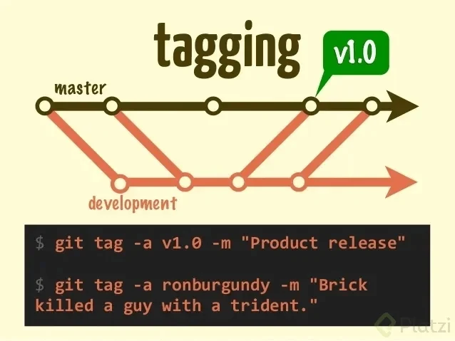

# CLASE MIÉRCOLES 27 DE ABRIL DEL 2024

> Lo que vimos en la clase anterior:
> <sub>
> Abrimos la terminal de Git Bash en Window o la terminal de Ubuntu, tambien la terminal de Mac, y comenzamos con los siguientes comandos y creación de directorios</sub>

```sh
pwd  #Vemos la ruta de la carpeta en la que estamos

cd #Es para navegar a una carpeta: change directory -> cambiar de directorio

cd / #Nos llava al home, en la raíz del disco

cd ~ #La virgulilla significa que estamos en el lugar de los documentos o del usuario

ls #Esto es listar los archivos, nos muestra todos los archivos en la raíz

ls -al #El espacio -al significa que es un argumento especial para ver archivos ocultos

#Usar la flecha hacía arriba nos muestra el último comando utilizado

ls -l #Muestra casi todos los archivos sin los que están ocultos

ls -a #Muestra el grupo de archivos pero no en una lista

clear #Limpia la consola o ctrl + l

cd .. #Nos devuelve a la carpeta anterior

cd U + tab #Esto se usa para un autocompletado o para buscar una referencia

cd /D #Cambiamos de disco en window

df -h #Muestra todos los directorios en Ubuntu

cd /mnt/d #Cambia de directorio usando WSL Ubuntu en window

```

## AHORA COMENZAMOS CON LA CREACIÓN DE CARPETAS

```sh
cd ..

cd ..

cd /mnt/c

cd ~ #Vamos a la raíz

mkdir Tecnicatura #Recordar que en window las mayúsculas no tienen relevancia, pero si en Linux

cd tecnicatura

mkdir Python

mkdir Java

mkdir JavaScript
```

<sub> Revisar y ejecutar cada comando, hacerlo como practica </sub>

<sub> Profesor Ariel Betancud </sub>

# CLASE MIÉRCOLES 3 DE ABRIL DEL 2024

> Abrir git bash en Window o la terminal de Linux o de Mac: al abrir Git Bash hacerlo como administrador

```sh
touch vacio.txt #Crea un archivo con su extención: ESCRIBIR DENTRO

ctrl + s #Guardamos lo que escribimos en el archivo

./ #Significa la carpeta actual

../ #Significa la carpeta anterior

cat vacio.txt #Vemos el contenido del archivo

history #Veremos la historia completa de los comandos que hemos utilizado

!72 + enter #Veremos el comando que utilizamos en ese número

rm vacio.txt #Borra el archivo seleccionado, ¡¡¡¡CUIDADO!!!!

rm --help #Muestra como funciona el comando
```

## CREAR UN REPOSITORIO DE GIT Y HAZ TU PRIMER COMMIT

```sh
cd tecnicatura

mkdir class-git

cd class-git #Entramos en la carpeta que necesitamos trabajar

git init #Creamos un repositorio en la carpeta central, se crea el archivo .git

code .  #Abrimos VSC, el punto hace que se abra el archivo en el que estamos situados

ctrl + n #Creamos un archivo nuevo y escribimos en el, como lo hicimos antes

ctrl + s #Guardamos poniendo el nombre: historia.txt

git status #Vemos el estado del proyecto en tiempo real, esta en el área de trabajo

git add historia.txt #Enviamos el archivo al área de preparación

git status #Para ver el estado de cambios

git rm --cached historia.txt #Quitamos el archivo del área de preparación, cached significa que esta en memoria ram

git config #Tedremos la lista de como funciona la configuración

git config --list #Configuraciones por defecto, faltan cosas importantes

git config --list --show-origin #Veremos donde están las configuraciones guardadas

git config --global user.name "Ariel Betancud"

git config --global user.email "betancudariel@gmail.com" #El correo debe ser el mismo que usaremos en GitHub

git config --list #Ahora veremos que ya están todos los datos completos

git add . #Ingresamos todos los archivos al área de preparación (ram)

git commit -m "Mensaje importante del commit" #El primer commit esta hecho

code . #Hacemos cambios en el archivo y guardamos

git status #Hay cambios para commitear

git add .

git commit -m "Mi segundo commit"
```

<sub>
git log historia.txt #Vemos toda la historia de este archivo, el número largo es el hash del commit</sub>

Revisar y ejecutar cada comando, hacerlo como practica

Profesor Ariel Betancud

# CLASE MIÉRCOLES 10 DE ABRIL DEL 2024

> Analizar cambios en los archivos de tu proyecto Git parte 3

### Ingresamos de la siguiente manera:

> Abrir git bash en Window o la terminal de Linux o de Mac: al abrir Git Bash hacerlo como administrador, en terminal también o usar sudo para permisos especiales.

```sh
cd tecnicatura #Ingresamos al direcotorio donde están nuestras carpetas de trabajo

ls #Vemos los archivos y directorios que ya tenemos

cd git #No hay nada

cd .. #Salimos

rm historia.txt #Eliminamos el archivo que habíamos hecho, esto en git bash (window) esto es para practica

rm Git #rm: cannot remove 'Git': Is a directory

rm --recursive -R Git #By default, rm does not remove directories. Use the --recursive (-r or -R) arguments

option to remove each listed directory, too, along with all of its contents. Esto es para practica

rm --help #Nos muestra lo que les puse arriba como documentación en Inglés.

mkdir class-git #Creamos la carpeta o directorio para trabajar en Git local por ahora.

cd class-git #Entramos para crear el README.md para este sector.

touch README.md #Vamos a crear un archivo nuevo, md significa markdown y se pueden trabajar con editores de texto, este es un lenguaje que transforma el texto a html.
```

Enlace a la documentación en GitHub de MARKDOWN

Leemos la documentación para ir creando en README.md como lo enseña GitHub.

code . #Abrimos VSC para editar el archivo.

Empezamos a cargar lo visto en las clases anteriores (Comandos) en el README y pasamos a commitear

```sh
git status

git add .

git status

git commit -m "Cargamos el README dentro del directorio class-git"

git status

git log #Para ver los dos commits hechos: Si tienes commiteada alguna clase anterior veras mas commits de los que yo tengo.

cd ..

cd ..
```

<sub>
Revisar y ejecutar cada comando, hacerlo como practica 
<sub/>

<sub>
Profesor Ariel Betancud
</sub>

# CLASE 01 MIÉRCOLES 14 DE AGOSTO DEL 2024

## USO DE GITHUB Parte 1

GitHub es una plataforma que nos permite guardar repositorios de Git que podemos usar como servidores remotos y ejecutar algunos comandos de forma visual e interactiva (sin necesidad de la consola de comandos).

Luego de crear nuestra cuenta, podemos crear o importar repositorios, crear organizaciones y proyectos de trabajo, descubrir repositorios de otras personas, contribuir a esos proyectos, dar estrellas y muchas otras cosas.

## COMANDOS

**Import repository**, **New repository**, **New organization**: significa que es como tu empresa,  
**New project**: significa es como un grupo de repositorios que puedes tener dentro de una empresa,  
**New gist**: es un pedacito de código que puedes compartir.

### New repository

- **Ponemos el nombre**: `class-git`
- **Descripción**: Haremos un blog increíble.
- **Licencias**: Hay muchas licencias para publicar el código, pero **NO** lo hacemos ahora.

### Create repository

- Lo ponemos en **privado** o en **público**.

El `README.md` es el archivo que veremos por defecto al entrar a un repositorio. Es una muy buena práctica configurarlo para describir el proyecto, los requerimientos y las instrucciones que debemos seguir para contribuir correctamente.

### Clonar un repositorio

Para clonar un repositorio desde GitHub (o cualquier otro servidor remoto) debemos copiar la URL (por ahora, usando HTTPS) y ejecutar el comando:

```bash
git clone URL

Esto descargará la versión de nuestro proyecto que se encuentra en GitHub.

ATENCIÓN:
¿Por qué usar HTTPS? Porque nos pedirá usuario (nombre perfil) y contraseña.

Sin embargo, esto solo funciona para las personas que quieren empezar a contribuir en el proyecto.

Conectar un repositorio de GitHub a nuestro documento local
Si queremos conectar el repositorio de GitHub con nuestro repositorio local, aconsejo que al trabajar desde GitHub no utilicemos localmente el comando git init. Debemos ejecutar las siguientes instrucciones:

1. Guardar la URL del repositorio de GitHub con el nombre de origin:

git remote add origin URL

2. Verificar que la URL se haya guardado correctamente:

git remote
git remote -v

3. Traer la versión del repositorio remoto y hacer merge para crear un commit con los archivos de ambas partes. Podemos usar:

git fetch
git merge

O solo:

git pull origin master --allow-unrelated-histories

4. Finalmente, podemos hacer git push para guardar los cambios de nuestro repositorio local en GitHub:

git push origin master


Cómo autenticarte en GitHub 2022

1. Antes de empezar, debemos renombrar la rama master a main, este es el nuevo estándar en GitHub. Para esto:

2. Posicionarnos en la rama que queremos renombrar.

Ejecutar el siguiente comando:

git branch -M main


Pasos para crear un token de acceso personal
Desde el 2022, GitHub ya no permite hacer push con la contraseña del propio GitHub. Para esto tenemos que crear un token, y este token es la contraseña que vamos a colocar cuando nos pida clave.

Cómo crear un token:
1. Ingresamos a nuestra cuenta de GitHub.
2. Buscamos Settings.
3. Click en Developer settings.
4. Click en Personal access tokens.
5. Click en Generate new token.

Aquí se puede colocar un nombre, la fecha de expiración, tildar en repo y luego hacer click en el botón verde Generate token.
```

# CLASE 02 - MIÉRCOLES 21 DE AGOSTO DEL 2024

## Cargar la llave SSH pública en GitHub

Para copiar la llave pública, debes ir al archivo `.ssh` y allí encontrarás el archivo `.pub`. Lo puedes abrir con un editor de texto (como un `.txt`) y luego copiar el contenido que está dentro.

### Pasos:

1. Copiar la llave pública.
2. Ir a GitHub, a **Settings** y luego a **SSH and GPG keys**.
3. Crear una nueva llave SSH:
   - Hacer click en **New SSH key**.
   - Poner un nombre y pegar la llave SSH pública.
   - Con esto estará listo.

> **Recomendación**: Es aconsejable que la llave SSH tenga el nombre del ordenador en el que estás trabajando. Este proceso se debe hacer con cada nueva PC o dispositivo que utilices para acceder a tu cuenta de GitHub.

---

## Comandos útiles:

- Ver en qué rama estamos:

  ```bash
  git branch
  ```

- Cambiar a la rama `master`:

  ```bash
  git checkout master
  ```

- Cambiar el nombre de la rama `master` a `main`:

  ```bash
  git branch -M main
  ```

- Agregar el repositorio remoto (reemplazar `nombreUsuario` con tu nombre de usuario):

  ```bash
  git remote add origin git@github.com:nombreUsuario/class-git.git
  ```

- Verificar si ya está conectado:

  ```bash
  git remote -v
  ```

- Hacer un `merge` de la rama `segunda` en `main`:

  ```bash
  git merge segunda
  ```

- Realizar un commit con un mensaje:

  ```bash
  git commit -am "Uso de GitHub parte 20"
  ```

- Subir los cambios a GitHub:

  ```bash
  git push origin main
  ```

---

## Notas sobre el cambio de nombre de la rama `master` a `main`:

Frente al cambio de nombre de la rama `master` a `main`, puede suceder que en el repositorio de GitHub se creen dos ramas: la rama `master` y la rama `main`. Para solucionarlo:

1. Ir al repositorio en GitHub.
2. Ir a **Settings**.
3. Cambiar la rama principal de `master` a `main`.
4. Después de esto, ya se puede borrar la rama `master`.

# CLASE 03 - MIÉRCOLES 28 DE AGOSTO DEL 2024

## Cambios en GitHub: de `master` a `main`

El escritor argentino Julio Cortázar afirma que las palabras tienen color y peso. Por otro lado, los sinónimos existen por definición, pero no expresan lo mismo. **Feo** no es lo mismo que **desagradable**, ni **aromático** es lo mismo que **oloroso**.

Por lo anterior, podemos afirmar que los sinónimos no expresan lo mismo, no tienen el mismo “color” ni el mismo “peso”.

> **Sí**, esta lectura es parte de la enseñanza profesional de **Git & GitHub**.

Desde el 1 de octubre de 2020, GitHub cambió el nombre de la rama principal: ya no es `master` —como aprenderás aquí— sino `main`.

Este cambio surgió a raíz de una reflexión profunda, provocada por el movimiento **#BlackLivesMatter**.  
La industria de la tecnología lleva muchos años utilizando términos como **master**, **slave**, **blacklist** o **whitelist**, y se espera que pronto estos términos puedan desaparecer.

> **Y sí, las palabras importan.**

Por lo tanto, de aquí en adelante, cada vez que me escuches mencionar “master”, debes saber que hago referencia a “main”.

### ¿Cuándo sigue siendo `master` y cuándo es `main`?

Cuando se crea un repositorio desde Git Bash en nuestro ordenador usando `git init`, sigue siendo el estándar como `master`.  
¿Qué hacer con esto? Debes cambiar el nombre de la rama `master` a `main` con el siguiente comando:

```bash
git branch -M main

Ahora, cuando creamos un repositorio desde la nube (desde GitHub), la rama principal tendrá por defecto el nombre de main, y al clonarlo en nuestro ordenador seguirá teniendo este nombre. En este caso, no será necesario ningún cambio.
```

# CLASE 04 - MIÉRCOLES 4 DE SEPTIEMBRE DEL 2024

## Tu primer `push`

La creación de las llaves **SSH** es necesaria solo una vez por cada computadora. Aquí aprenderás cómo conectarte a GitHub usando **SSH**.

Luego de crear nuestras llaves **SSH**, podemos entregarle la llave pública a GitHub para comunicarnos de forma segura y sin necesidad de escribir nuestro usuario y contraseña todo el tiempo.

### Pasos para configurar la llave SSH:

1. Ir a la configuración de **SSH Keys** en GitHub.
2. Crear una nueva llave con el nombre que desees.
3. Pegar el contenido de la llave pública de tu computadora.

Ahora podemos actualizar la URL que guardamos en nuestro repositorio remoto, pero en lugar de usar **HTTPS**, vamos a usar la URL con **SSH**:

```bash
git remote set-url origin url-ssh-del-repositorio-en-github

Comandos para copiar la llave SSH pública:

Mac:
pbcopy < ~/.ssh/id_rsa.pub

Windows (Git Bash):
clip < ~/.ssh/id_rsa.pub

Linux (Ubuntu):
cat ~/.ssh/id_rsa.pub

Importante
Las buenas prácticas nos enseñan que antes de hacer un push, siempre debemos hacer un pull o un fetch, para asegurarnos de que si alguien ha hecho algún cambio, no se generen conflictos.

Invitar a un colaborador
Para invitar a un colaborador a tu proyecto en GitHub, sigue estos pasos:

1. Ve a Settings en el repositorio.
2. Selecciona Collaborators.
3. Ingresa tu contraseña o utiliza el 2FA (autenticación de dos factores) para verificar.
4. Enviar la invitación escribiendo el nombre de usuario del colaborador.

Del otro lado, el usuario invitado solo debe aceptar la invitación y ya podrá participar en el proyecto haciendo commits.
```

# CLASE 05 - MIÉRCOLES 11 DE SEPTIEMBRE DEL 2024

## Git tags y versiones en GitHub

En Git, las **etiquetas** o **Git tags** juegan un papel importante al asignar versiones a los commits más significativos de un proyecto. Aprender a utilizar el comando `git tag`, entender los diferentes tipos de etiquetas, cómo crearlas, eliminarlas y compartirlas es esencial para un flujo de trabajo eficiente.

---

### Creación de etiquetas en Git

Para crear una etiqueta, utiliza el siguiente comando:



```bash
git tag

Sustituye con un identificador semántico que refleje el estado del repositorio en ese momento. Git admite dos tipos de etiquetas:

. Etiquetas anotadas: almacenan información adicional como la fecha, el etiquetador y el correo electrónico. Son ideales para publicaciones públicas.

. Etiquetas ligeras: más simples, utilizadas como "marcadores" de una confirmación específica.

Listado de etiquetas
Para obtener una lista de las etiquetas en el repositorio, ejecuta:

git tag

Esto mostrará una lista de las etiquetas existentes, como:

. v1.0
. v1.1
. v1.2

Para perfeccionar la lista, puedes utilizar opciones adicionales como -l con una expresión comodín.

Uso compartido de etiquetas

Las etiquetas no se envían automáticamente al repositorio remoto, por lo que para compartirlas debes hacerlo explícitamente con el comando git push. Para enviar una etiqueta específica, usa:

git push origin nombre-de-la-etiqueta

Para enviar todas las etiquetas a la vez:

git push origin --tags

Eliminación de etiquetas
Para eliminar una etiqueta en el repositorio local, utiliza el siguiente comando:

git tag -d nombre-de-la-etiqueta

Resumen:

Las etiquetas en Git son esenciales para asignar versiones y capturar instantáneas importantes en el historial de un proyecto. Aprender a crear, listar, compartir y eliminar etiquetas mejorará significativamente tu flujo de trabajo con Git.


```
