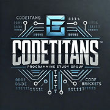
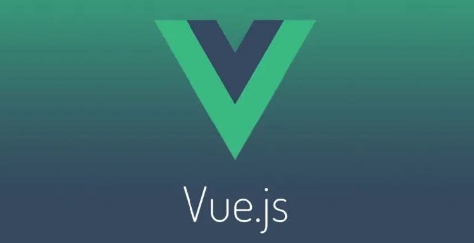

# CodeTitans

## Descripción

Repositorio para el segundo semestre del grupo **"CodeTitans"** estudiantes de la Tec. en Programación UTN.

## Integrantes

- **Gonzalez, Leandro**
- **Villarraza, Ignacio**
- **Pacheco, Guillermo**
- **Taraboreli, Denis**
- **Zalloco, Martiniano**

## Proyecto

[Nuestro proyecto Java](https://github.com/PowerSystem2024/CodeTitansIntegradorJava/tree/main/ProyectoIntegradorJava)

[Nuestro Portafolio en Vue](https://codetitans-utn.netlify.app/)

## Tecnologías

- **Java**
- **JavaScript**
- **Python**
- **MySQL**
- **Vue**

## Herramientas

- **Git**
- **GitHub**
- **Netlify**
- **Vue CLI**

## Enlaces

- [Nuestro proyecto Java](https://github.com/PowerSystem2024/CodeTitansIntegradorJava/tree/main/ProyectoIntegradorJava)
- [Nuestro Portafolio en Vue](https://codetitans-utn.netlify.app/)
